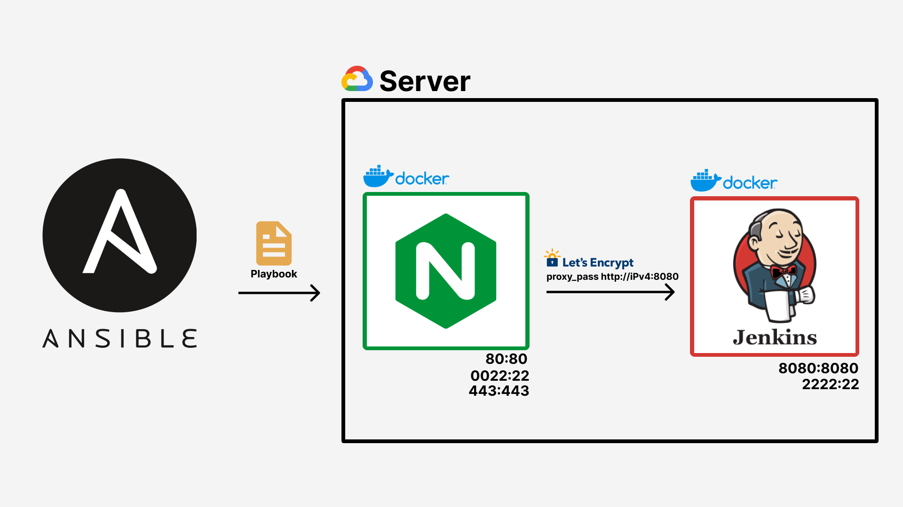

# Setting up Jenkins in a Container with Nginx as a Reverse Proxy for SSL

## Introduction
This guide demonstrates how to run Jenkins securely within a container, utilizing nginx as a reverse proxy for SSL. This setup ensures a safe environment for Jenkins. In this example, we'll deploy Jenkins and Nginx to a remote server using Ansible (`run-playbook.yaml`) and Docker Compose (`docker-compose.yaml`).

## Project Overview:


## Containers Used:
- Jenkins
- Nginx (as a reverse proxy for SSL)

(Both containers operate on the same server)
(Additional containers can be easily added to this setup)

## Prerequisites:
- A domain name (You can use DuckDNS for a free domain name)
- Public IP address of your server instance
- Server instance (e.g., AWS EC2, DigitalOcean Droplet, etc.)
- Ansible installed on your local machine (if using Ansible playbook)
- Git installed on your local machine (if using Ansible playbook)

## Installation Steps:
1. Clone this repository to your local machine.
2. Navigate to the repository's root directory.
3. Open `run-playbook.yaml` and replace `remote_user` and `ansible_ssh_private_key_file` with your credentials.
4. Adjust the paths in `run-playbook.yaml` and `docker-compose.yaml` to match your own setup.
5. Modify the configuration in `config/jenkins.conf` by adding your domain name (DuckDNS can be used for a free domain).
6. Execute the following command to deploy Jenkins and Nginx on your remote server:
   ```bash
   ansible-playbook run-playbook.yaml
   ```
7. Once the playbook completes successfully, access your domain name in a web browser. You should see the Jenkins login page.
8. Log in to Jenkins using the initial admin password.